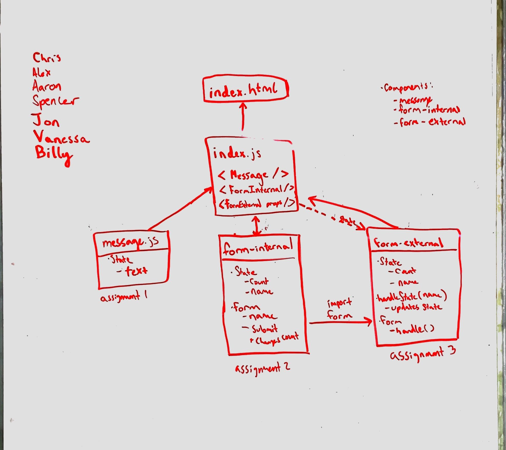

# Lab 28 ~ Spencer Hirata

#### Props
* [Props PR](https://github.com/401-advanced-js/seattle-javascript-401d29/pull/1)
* [Props Forked repo](https://github.com/401-advanced-js/seattle-javascript-401d29/tree/csb-1556141188364/curriculum/class-28/lab/starter-code/props)

#### Internal
* [Internal State PR](https://github.com/401-advanced-js/seattle-javascript-401d29/pull/2)
* [Internal Forked repo](https://github.com/401-advanced-js/seattle-javascript-401d29/tree/csb-1556169799401/curriculum/class-28/lab/starter-code/internal-state)

#### External
* [External State PR]()
* [External Forked repo]()

### UML
